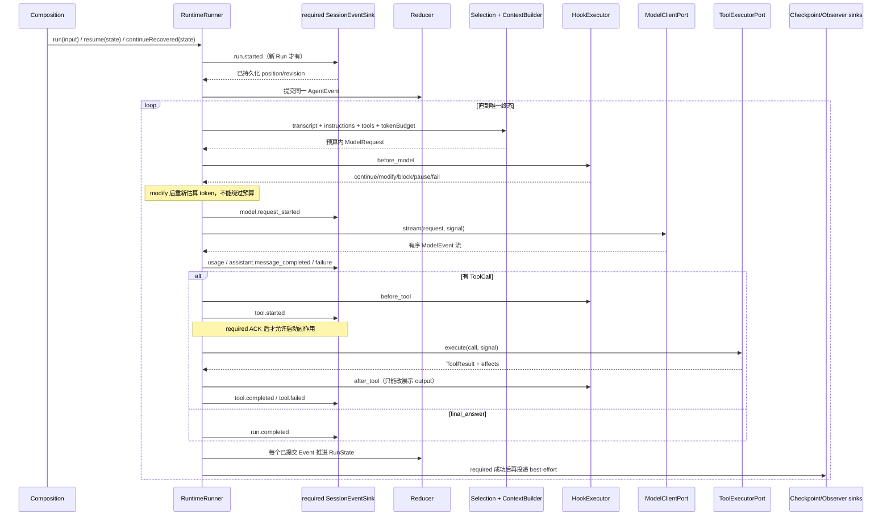
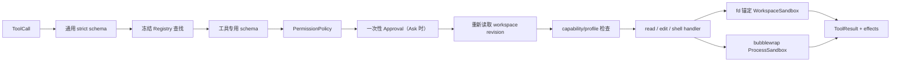
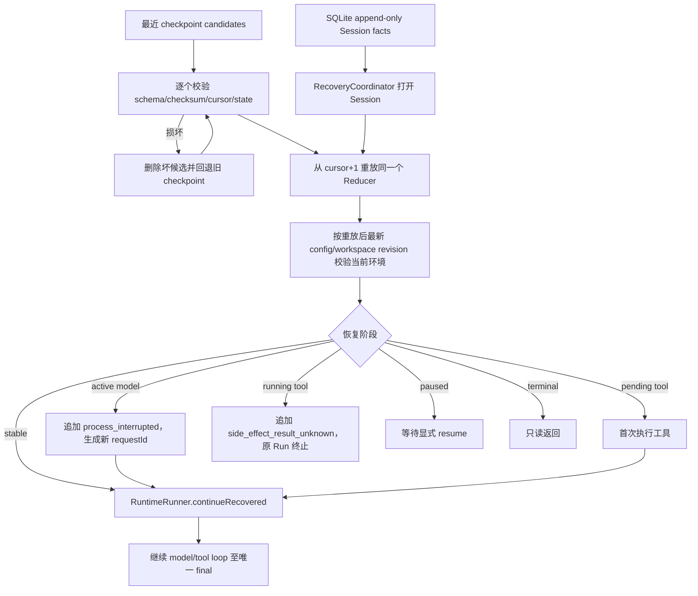

# M2–M4 实际数据流

```yaml
status: current
updated: 2026-08-24
scope: Runtime 正常闭环、工具安全链、持久化顺序与跨进程恢复
related_code:
  - /home/han001/projects/agents/coding-agent/src/core/runtime/
  - /home/han001/projects/agents/coding-agent/src/tools/
  - /home/han001/projects/agents/coding-agent/src/storage/
```

## 正常运行主链



状态不会由 Model、Tool、Hook 或 Store 直接改写。Runner 先用同一 Event 计算候选状态，required
sink 全部成功后才接受 Reducer 结果；best-effort sink 超时或失败只记诊断。

## Context 裁剪

```text
输入候选
  → 删除低优先级 Memory
  → 删除低优先级 Skill
  → 删除低优先级附加 Instruction
  → 从最旧开始删除“assistant + 其完整 ToolResult”闭合组
  → 仍超预算则 ContextSelectionError
  → ContextBuilder 生成确定性 ModelRequest
  → before_model Hook 若修改请求，重新估算并再次执行硬预算
```

最新 user
message、未闭合 ToolCall 及其配对关系不会被单独裁掉。模型事件数与聚合字符数均有上限，防止零字符事件无限占用内存。

## M3 工具安全链



审批绑定 operation fingerprint 和审批前 revision；用户等待期间 workspace 变化会拒绝执行。`edit` 的
`newRevision` 是单文件内容版本，`effects.workspaceRevision`
是整个 workspace 快照版本，两者用途不同。ProcessSandbox 通过已打开根目录 fd 绑定 workspace，并覆盖
`.git`、`.env`、凭据和 evaluator/oracle 路径；bubblewrap 能力不足时 shell fail closed。

## M4 持久化与恢复链



`SessionEventSink` 是 required 持久化屏障；`CheckpointingEventSink`
只在稳定边界保存派生快照。工具返回新的 workspace
revision 时，后续 checkpoint 会同步该版本，因此 Agent 自己已经确认的 edit 不会在重启时被误判成外部修改。Checkpoint 可丢弃；Session
facts 才是真相来源。
