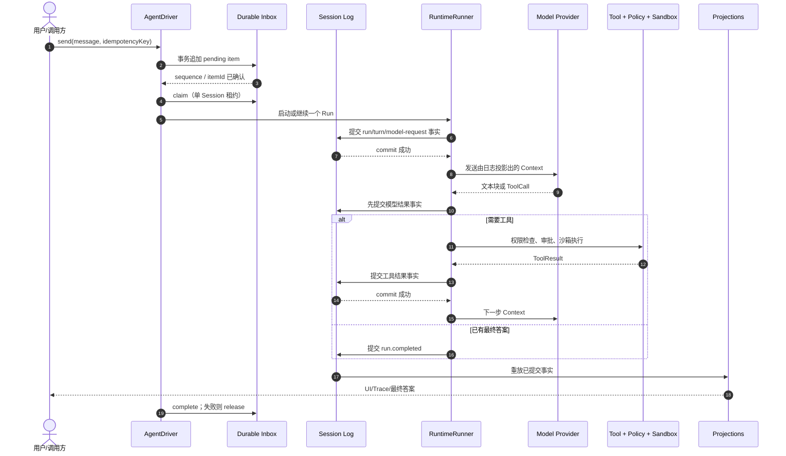

# 下一阶段 Agent 数据流

```yaml
status: active
baseline_commit: a91cde6
completed_stage: A2
next_stage: A3
updated: 2026-08-27
```

## 一条消息怎样安全地变成答案



## 为什么一定要“先记账，再生效”

如果先改内存状态、后写磁盘，写盘失败时会出现两个世界：进程认为工具已执行，恢复后却认为没有执行，可能重复修改文件。当前 required
sink 已经避免了这个问题；Inbox 也先持久化 pending
item，再允许 Driver 领取。Inbox 是待办真相，Session Log 是执行事实真相，两者职责不同。

## 重启恢复

1. 读取 Session Header，校验 schema、lineage 和 `profileDigest`；
2. 按 position 验证校验和并重放 KernelEvent；
3. 从 `inbox_items` 读取顺序/租约状态，从 Session 重建 RunState；
4. 对“已开始但结果未知”的外部操作做 reconciliation，不能猜成功；
5. 只有恢复到稳定边界后，Driver 才领取下一条输入。

其中 Session/Profile/RunState 在 A1 落地，Inbox 状态和 Driver 恢复在 A2 落地。独立 Context
Projection 由 A3 补齐。

## 压缩不是删除

上下文过长时，Compactor 追加一条 `context.summary.created`
事实，写明来源 position 区间、摘要器版本和摘要内容。模型投影可以选择摘要，审计和恢复仍能读取原始记录。需要回到过去时创建 fork，不改写原 Session。

## 多 Agent 数据流

父 Agent 创建子 Agent 时：

1. Supervisor 检查深度、预算和权限；
2. 为子 Agent 创建独立 Session、Inbox 和 Profile；
3. 父 Session 记录 delegation 请求和 childSessionId；
4. 子 Agent 独立运行；
5. 子结果作为一条已校验输入回到父 Session；
6. 父取消时，Supervisor 向下传播取消，但保留各自日志。

这里不共享可变 `RunState`，所以一个子 Agent 崩溃不会把兄弟 Agent 的状态一起破坏。
