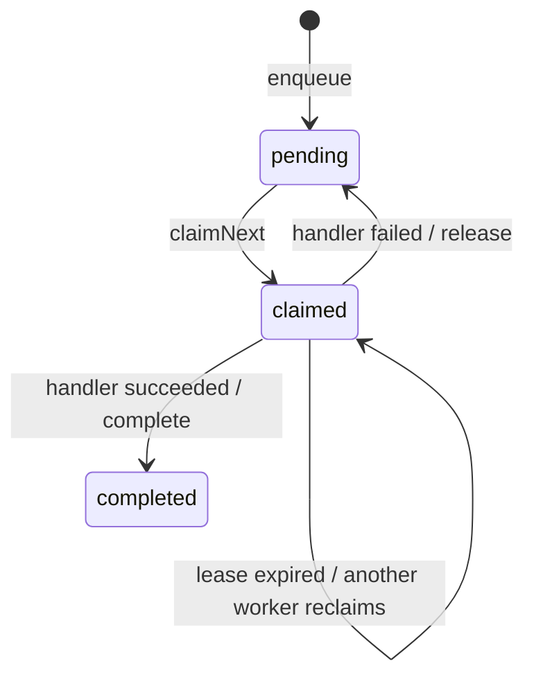

# A2 Durable Inbox 与 AgentDriver

```yaml
status: implemented
stage: A2
updated: 2026-08-27
```

## 一分钟读懂

把 Session 想成“已经发生的账本”，把 Inbox 想成“还要处理的排队单”。两者不能混：

- Inbox 决定哪条消息排第几、有没有被领取、是否处理完；
- Session Log 记录模型请求、工具调用和 Run 状态事实；
- AgentDriver 一次只从一个 Session 的 Inbox 领取一条，再交给 RuntimeRunner。

因此进程重启时，不需要猜“用户那条消息到底收到没有”；pending item 仍在 SQLite。

## 状态机



`completed` 不会重新入队。`pending` 重新领取时 `deliveryAttempt`
加一；失败原因和最后一次 claim 保留用于诊断。

## 为什么不会重复领取

1. 每个 Session 的 sequence 在 SQLite `BEGIN IMMEDIATE` 短事务中分配；
2. `UNIQUE(session_id, idempotency_key)` 防重复入队；
3. partial unique index 保证一个 Session 最多一行 `status='claimed'`；
4. claim 有 token、owner 和截止时间；同 token 的 ACK 重试返回原 item；
5. Driver 在长任务中续租；只有进程死亡、租约真正过期后才允许重领。

InMemory 和 SQLite 使用同一个 Port/contract，SQLite 的约束负责跨进程竞争。

## 幂等键怎样工作

同一 Session 内：

- 相同 key + 相同 user message：返回第一次创建的 item；
- 相同 key + 不同 message：`idempotency_conflict`；
- 生产入口把 `sessionId + idempotencyKey` 哈希成稳定 itemId；
- runId、turnId 和 messageId 再由 itemId 稳定派生。

所以 API/CLI 重试不会产生第二个 Turn。CLI 使用：

```text
coding-agent run --session demo --input "修复测试" --idempotency-key request-123
```

未提供 key 时，每次调用都视为一条新消息。

## 失败窗口怎样处理

| 失败位置                     | 处理                                                             |
| ---------------------------- | ---------------------------------------------------------------- |
| 入队事务失败                 | 没有 item，不执行                                                |
| claim 后、handler 前进程死亡 | item 保持 claimed，租约过期后重领                                |
| handler 明确失败             | release 为 pending，保留 failure，下一次 attempt 恢复同一 Run    |
| handler 成功、complete 失败  | 不 release，避免立即重复副作用；保留 claim 供恢复/reconciliation |
| 用户取消                     | 取消模型/工具；Driver 用独立短事务写完 complete/release          |
| ToolStarted 后结果未知       | Session Recovery 标记 `side_effect_result_unknown`，绝不猜测重放 |

通用 `AgentDriver`
的 handler 仍应使用 itemId 作为执行幂等身份。生产 handler 已把它绑定到稳定 run/turn
ID，并在 Turn 已存在时走 `RecoveryCoordinator`。

## 数据库存储

database schema v3 新增 `inbox_items`：

- JSON 保存完整 strict-schema item；
- 索引列保存 session、sequence、item/key、status、active claim 和 lease；
- 读取时 JSON 与索引列交叉验证，不一致即 `corrupt`；
- A1 database schema v2 打开时自动创建表并升级 metadata；未知更高版本拒绝打开。

## 已验证

- InMemory/SQLite 同一 contract：幂等 enqueue、claim ACK、renew、complete、release；
- 删除 A2 表模拟 A1 schema v2 后，可以原位升级到 v3；
- SQLite 关闭重开后 pending 消息仍可领取；
- 两个 SQLite 连接同时 claim，只有一个成功；
- 同一 Driver 并发处理同 Session 明确 `AgentDriverBusyError`；
- handler 失败后再次处理，`deliveryAttempt` 从 1 增加到 2；
- 调用方取消后，Driver 仍用独立生命周期信号释放消息；
- handler 成功但 complete 失败时保留 claim，绝不 release 并立即重放；
- 生产 Composition 的重复幂等请求只有一个 completed Inbox item 和一个 Turn；
- 全仓门禁：31 个测试文件，105 passed、3 skipped，architecture check 与 benchmark preflight 通过。

## 当前边界

A2 先实现普通 `user_message`。运行中 `steer`、`follow-up`
的产品策略尚未暴露；未来增加时必须复用 Inbox 的顺序、幂等和租约，不允许直接修改运行中的可变 Context。

现有 `resume`
是运维恢复入口，不会抢占或确认 Inbox 租约，因此不能和在线 Driver 并发运行；恢复后的 Inbox 终态由下一次合法领取的 Driver 对账并确认。后续会把这类运维协调做成显式 Supervisor 能力。
